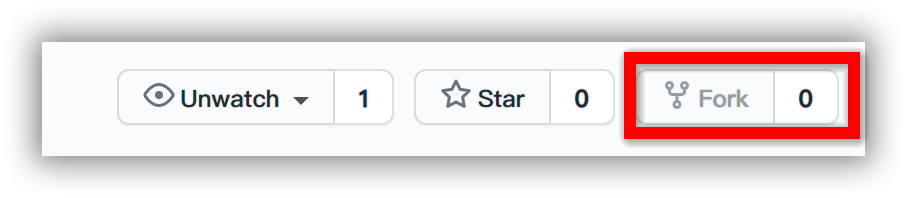
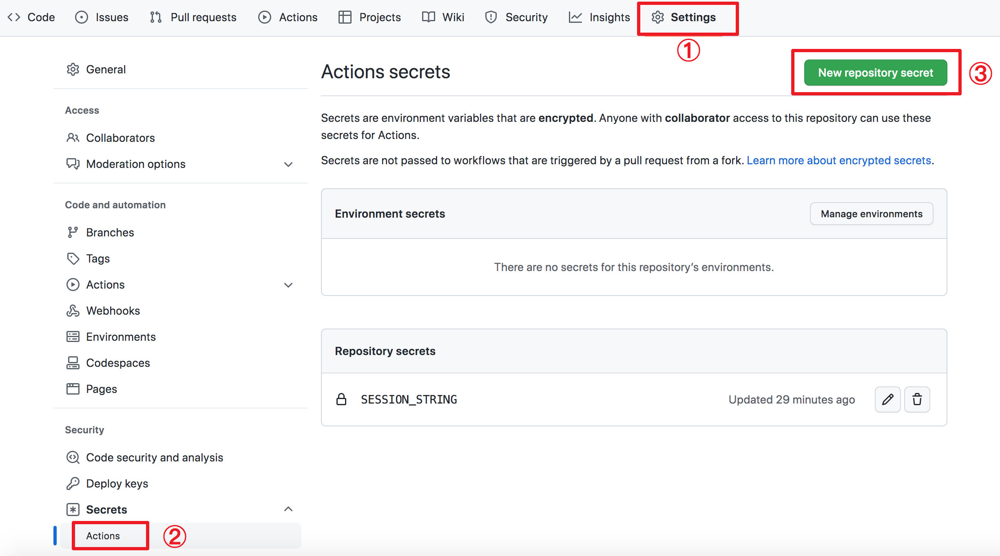
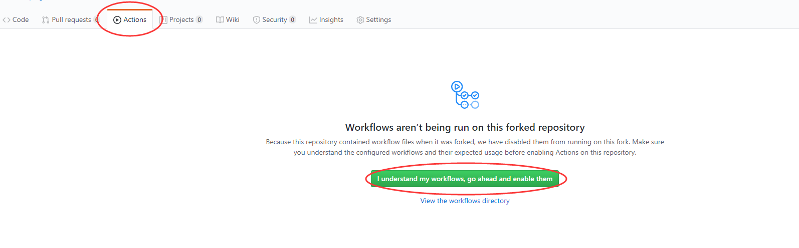
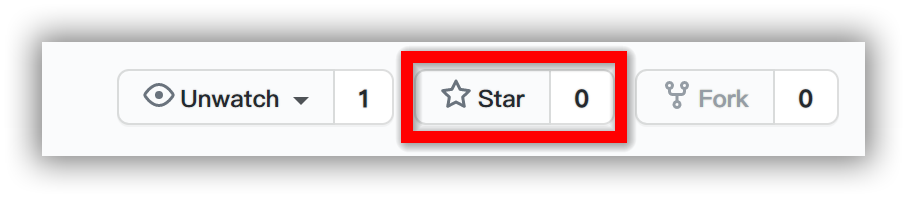
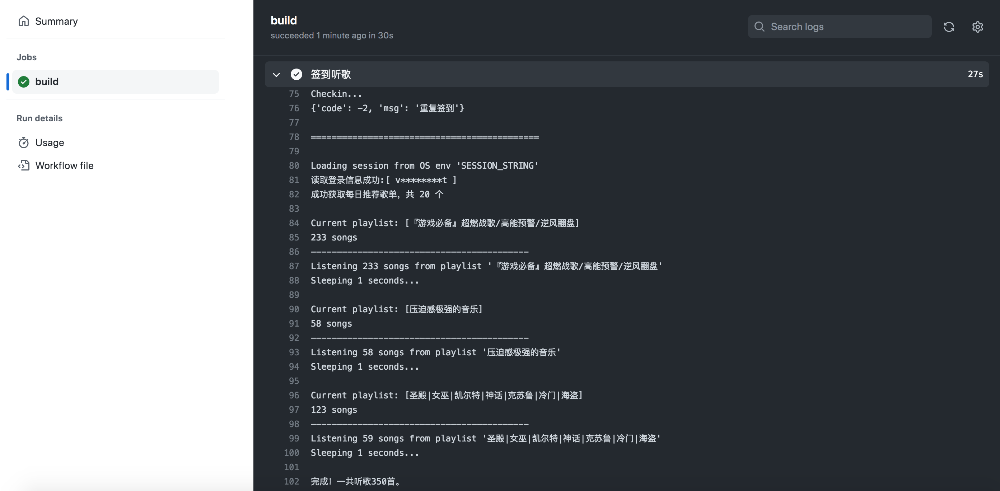

## Checkin And Listen

### 1. Fork this repo



### 2. Get session string

```shell
git clone https://github.com/lixvbnet/ncm-tools.git
cd ncm-tools
pip3 install -r requirements.txt
python3 ncm_login.py
```

After successful login, get session string from `~/.ncm_cloud.key` , **copy its content**.


### 3. Add secrets

Add a secret:

- Name: `SESSION_STRING` 
- Secret: ***Paste the session string copied from previous step.*** 

> Settings -> Secrets (Actions) -> New repository secret




### 4. Enable Action

Click **Actions** , then click **I understand my workflows, go ahead and enable them** 



### 5. Trigger Action

- Automatically trigger every day
- Manually trigger by **Star** your repo



### 6. View build logs

Click **Actions** -> **${ActionName}** -> **build** 

